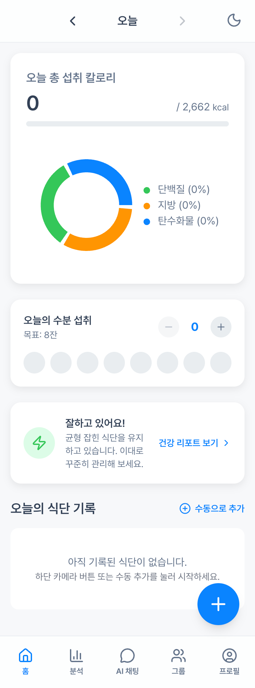
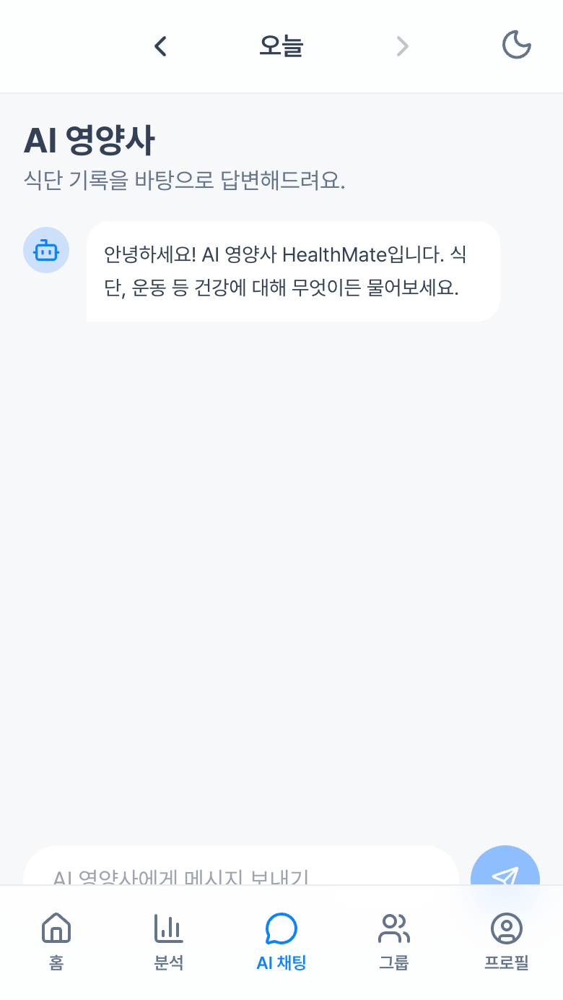
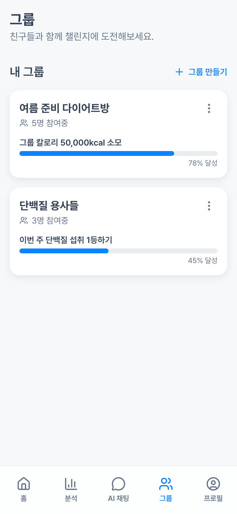
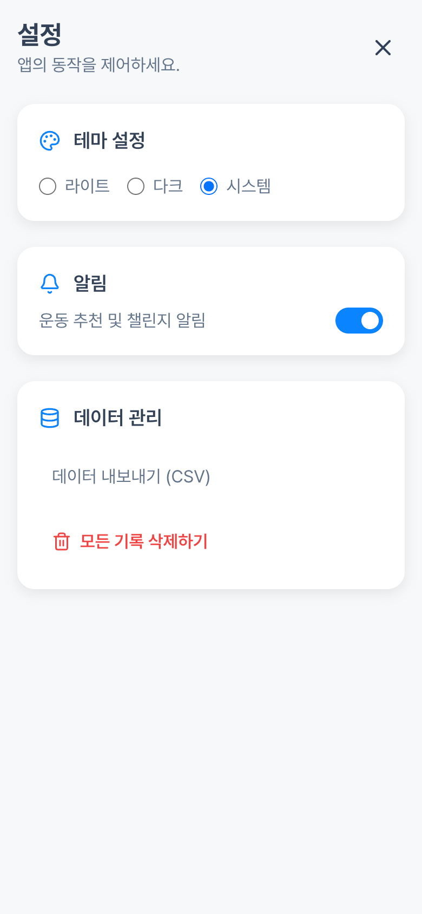

<div align="center">

# 🥗 DoDiet

### AI 기반 스마트 식단 관리 & 건강 코칭 애플리케이션

[](app/)
[](DoDiet-API/)
[](ai-식단-관리-healthmate%20(1)/)
[](#)

**음식 사진 한 장으로 시작하는 AI 영양 관리**

[빠른 시작](#-빠른-시작-가이드) •
[기능 소개](#-주요-기능) •
[API 문서](#-api-엔드포인트) •
[기여하기](#-기여-가이드)

</div>

---

## 📋 목차

- [프로젝트 소개](#-프로젝트-소개)
- [스크린샷](#-스크린샷)
- [주요 기능](#-주요-기능)
- [기술 스택](#-기술-스택)
- [프로젝트 구조](#-프로젝트-구조)
- [빠른 시작 가이드](#-빠른-시작-가이드)
- [환경 설정](#-환경-설정)
- [아키텍처 개요](#-아키텍처-개요)
- [API 엔드포인트](#-api-엔드포인트)
- [기여 가이드](#-기여-가이드)
- [라이선스](#-라이선스)
- [문서 링크](#-문서-링크)

---

## 🌟 프로젝트 소개

**DoDiet**는 AI 기술을 활용한 종합 식단 관리 및 건강 코칭 플랫폼입니다. Google Gemini Vision API를 통해 음식 사진을 분석하고, 개인 맞춤형 영양 정보와 건강 조언을 제공합니다.

### 왜 DoDiet인가?

- 🎯 **간편한 식단 기록**: 사진 한 장으로 자동 영양 분석
- 🤖 **AI 영양사**: 24시간 상담 가능한 개인 맞춤 AI 코칭
- 📊 **데이터 기반 인사이트**: 식습관 패턴 분석 및 개선 제안
- 🏆 **게이미피케이션**: 챌린지와 업적으로 동기 부여
- 👥 **소셜 기능**: 그룹 챌린지로 함께하는 건강 관리

---

## 📱 스크린샷

### 홈 화면
| 홈 대시보드 | 음식 추가 | 수동 입력 |
|:---:|:---:|:---:|
|  |  |  |

### 분석 & AI 기능
| 식단 분석 | AI 식단 플래너 | 건강 리포트 |
|:---:|:---:|:---:|
|  |  |  |

### AI 채팅 & 챌린지
| AI 영양사 채팅 | 챌린지 | 업적 |
|:---:|:---:|:---:|
|  | .png) | .png) |

### 그룹 & 소셜
| 그룹 목록 | 그룹 상세 | 그룹 만들기 |
|:---:|:---:|:---:|
|  |  |  |

### 프로필 & 설정
| 내 정보 | 업적 | 친구 | 설정 |
|:---:|:---:|:---:|:---:|
| .png) | .png) | .png) |  |

---

## ✨ 주요 기능

### 🍽️ 식단 관리
| 기능 | 설명 |
|------|------|
| 📸 **AI 음식 사진 분석** | Gemini Vision으로 음식 사진을 분석하여 칼로리, 탄수화물, 단백질, 지방 자동 계산 |
| ✏️ **수동 기록** | 텍스트로 음식을 입력하면 AI가 영양 정보 추정 |
| 📅 **식단 히스토리** | 날짜별 식단 기록 조회 및 관리 |
| 💧 **물 섭취 추적** | 일일 물 섭취량 기록 및 목표 관리 |

### 🤖 AI 기능
| 기능 | 설명 |
|------|------|
| 💬 **AI 영양사 챗봇** | Function Calling + 메모리 시스템으로 개인화된 상담 |
| 🍳 **AI 레시피 추천** | 냉장고 재료 기반 맞춤 레시피 생성 |
| 📋 **AI 식단 플래너** | 개인 목표에 맞는 하루 식단 계획 생성 |
| 🏃 **AI 운동 계획** | 섭취 칼로리 기반 맞춤 운동 추천 |

### 📊 분석 & 리포트
| 기능 | 설명 |
|------|------|
| 📈 **칼로리 트렌드** | 주간/월간 칼로리 섭취 추이 시각화 |
| 🎯 **영양 균형 분석** | 권장 비율 대비 영양소 섭취 레이더 차트 |
| 🕐 **식사 패턴 분석** | 요일/시간대별 식사 패턴 히트맵 |
| 📑 **주간 건강 리포트** | AI가 분석한 종합 건강 리포트 |

### 🏆 게이미피케이션
| 기능 | 설명 |
|------|------|
| 🎯 **챌린지 시스템** | 다양한 건강 목표 챌린지 참여 |
| 🏅 **업적 & 배지** | 목표 달성 시 배지 획득 |
| 👥 **그룹 챌린지** | 친구들과 함께 경쟁하며 동기 부여 |

### 👥 소셜 기능
| 기능 | 설명 |
|------|------|
| 📝 **그룹 피드** | 그룹 내 식단 공유 및 댓글/반응 |
| 👫 **친구 시스템** | 친구 추가 및 활동 공유 |
| 🏃‍♂️ **AI 챌린지 추천** | 그룹에 맞는 챌린지 AI 추천 |

---

## 🛠️ 기술 스택

### Android 앱 (`app/`)

| 분류 | 기술 |
|------|------|
| **언어** | Java 11 |
| **최소 SDK** | Android 7.0 (API 24) |
| **네트워킹** | Retrofit 2.9, OkHttp 4.12 |
| **이미지 로딩** | Glide 4.16 |
| **차트** | MPAndroidChart 3.1 |
| **인증** | Google Sign-In |
| **마크다운** | Markwon 4.6 |
| **UI** | Material Design, ViewPager2, RecyclerView |

### 백엔드 API (`DoDiet-API/`)

| 분류 | 기술 |
|------|------|
| **언어** | Java 17 |
| **프레임워크** | Spring Boot 3.2.5 |
| **ORM** | Spring Data JPA |
| **보안** | Spring Security, JWT (jjwt 0.12) |
| **데이터베이스** | PostgreSQL (Production), H2 (Test) |
| **캐싱** | Redis |
| **AI** | Google Gemini API |
| **알림** | Firebase Cloud Messaging |
| **문서화** | SpringDoc OpenAPI (Swagger) |
| **배포** | Docker, Docker Compose |

### 웹 프로토타입 (`ai-식단-관리-healthmate (1)/`)

| 분류 | 기술 |
|------|------|
| **언어** | TypeScript |
| **프레임워크** | React 19 |
| **빌드 도구** | Vite 6 |
| **AI** | @google/genai (Gemini) |
| **차트** | Recharts 3.3 |
| **아이콘** | Lucide React |
| **스타일링** | Tailwind CSS |

---

## 📁 프로젝트 구조

```
AI_DIET_APP/
├── 📱 app/                          # Android 애플리케이션
│   └── src/main/
│       ├── java/.../ai_diet_app/
│       │   ├── MainActivity.java    # 메인 액티비티
│       │   ├── fragments/           # UI 프래그먼트
│       │   ├── adapters/            # RecyclerView 어댑터
│       │   ├── network/             # Retrofit API 서비스
│       │   ├── data/model/          # 데이터 모델
│       │   └── utils/               # 유틸리티 클래스
│       └── res/                     # 리소스 파일
│
├── 🖥️ DoDiet-API/                   # Spring Boot 백엔드
│   └── src/main/
│       ├── java/.../dodietapi/
│       │   ├── controller/          # REST 컨트롤러
│       │   ├── service/             # 비즈니스 로직
│       │   ├── repository/          # JPA 리포지토리
│       │   ├── entity/              # 엔티티 클래스
│       │   ├── dto/                 # 데이터 전송 객체
│       │   ├── config/              # 설정 클래스
│       │   └── security/            # JWT 보안 설정
│       └── resources/
│           └── application.yml      # 애플리케이션 설정
│
├── 🌐 ai-식단-관리-healthmate (1)/   # React 웹 프로토타입
│   ├── components/                  # 재사용 컴포넌트
│   │   └── charts/                  # 차트 컴포넌트
│   ├── pages/                       # 페이지 컴포넌트
│   ├── services/                    # API 서비스
│   └── utils/                       # 유틸리티 함수
│
└── 📸 앱-화면-캡쳐/                   # 앱 스크린샷
```

---

## 🚀 빠른 시작 가이드

### 사전 요구사항

- **JDK 17+** (백엔드)
- **Android Studio** (안드로이드 앱)
- **Node.js 18+** (웹 프로토타입)
- **PostgreSQL** (데이터베이스)
- **Google Gemini API Key**

### 1️⃣ 백엔드 API 실행

```bash
# 프로젝트 디렉토리 이동
cd DoDiet-API

# 환경 변수 설정
cp .env.example .env
# .env 파일을 열어 필요한 값 설정

# 빌드 및 실행
./gradlew bootRun
```

서버가 `http://localhost:8080`에서 실행됩니다.

### 2️⃣ Android 앱 실행

```bash
# Android Studio에서 프로젝트 열기
# 1. File > Open > AI_DIET_APP 폴더 선택
# 2. Gradle Sync 완료 대기
# 3. app/src/main/res/xml/network_security_config.xml 에서 API 서버 주소 설정
# 4. Run 'app' 실행
```

### 3️⃣ 웹 프로토타입 실행

```bash
# 프로젝트 디렉토리 이동
cd "ai-식단-관리-healthmate (1)"

# 의존성 설치
npm install

# 개발 서버 실행
npm run dev
```

브라우저에서 `http://localhost:5173`으로 접속합니다.

### 🐳 Docker로 백엔드 실행 (선택)

```bash
cd DoDiet-API

# Docker Compose로 실행
docker-compose up -d
```

---

## ⚙️ 환경 설정

### 백엔드 환경 변수 (`.env`)

```bash
# 데이터베이스
DB_URL=jdbc:postgresql://localhost:5432/dodiet
DB_USERNAME=postgres
DB_PASSWORD=your-db-password

# JWT 인증
JWT_SECRET=your-very-long-secret-key-at-least-32-characters

# Google Gemini API
GEMINI_API_KEY=your-gemini-api-key

# Redis (선택사항)
REDIS_HOST=localhost
REDIS_PORT=6379

# 이메일 (선택사항)
MAIL_USERNAME=your-email@gmail.com
MAIL_PASSWORD=your-app-password
```

### 웹 프로토타입 환경 변수

Gemini API 키는 `constants.ts` 또는 환경 변수로 설정:

```typescript
// constants.ts
export const API_KEY = 'your-gemini-api-key';
```

### Android 앱 설정

1. **API 서버 주소 설정** (`RetrofitClient.java`):
```java
private static final String BASE_URL = "http://your-server-ip:8080/";
```

2. **Network Security Config** (`network_security_config.xml`):
```xml
<domain includeSubdomains="true">your-server-ip</domain>
```

---

## 🏗️ 아키텍처 개요

```
┌─────────────────────────────────────────────────────────────────┐
│                         Client Layer                             │
├─────────────────────────────────────────────────────────────────┤
│  📱 Android App          │  🌐 Web Prototype                     │
│  (Java + Retrofit)       │  (React + TypeScript)                │
└──────────────┬───────────┴────────────────┬─────────────────────┘
               │                            │
               │         HTTPS/REST         │
               ▼                            ▼
┌─────────────────────────────────────────────────────────────────┐
│                      API Gateway Layer                           │
├─────────────────────────────────────────────────────────────────┤
│                   Spring Boot REST API                           │
│            (JWT Authentication + Spring Security)                │
└──────────────┬──────────────────────────────┬───────────────────┘
               │                              │
     ┌─────────┴─────────┐          ┌─────────┴─────────┐
     ▼                   ▼          ▼                   ▼
┌──────────┐      ┌──────────┐  ┌──────────┐      ┌──────────┐
│PostgreSQL│      │  Redis   │  │ Gemini   │      │ Firebase │
│  (Data)  │      │ (Cache)  │  │   API    │      │  (FCM)   │
└──────────┘      └──────────┘  └──────────┘      └──────────┘
```

### 핵심 기술 흐름

1. **이미지 분석 흐름**:
   ```
   앱에서 사진 촬영 → 서버 업로드 → Gemini Vision API 분석 → 영양 정보 반환
   ```

2. **AI 챗봇 흐름**:
   ```
   사용자 메시지 → 대화 히스토리 로드 → Gemini API (Function Calling) → 응답 저장 및 반환
   ```

3. **인증 흐름**:
   ```
   로그인/회원가입 → JWT 토큰 발급 → 토큰으로 API 요청 인증
   ```

---

## 📡 API 엔드포인트

### 🔐 인증 (Auth)

| Method | Endpoint | 설명 |
|--------|----------|------|
| `POST` | `/api/auth/signup` | 회원가입 |
| `POST` | `/api/auth/login` | 로그인 |
| `POST` | `/api/auth/google-login` | Google 소셜 로그인 |
| `POST` | `/api/auth/send-code` | 이메일 인증 코드 발송 |
| `POST` | `/api/auth/verify-code` | 인증 코드 확인 |
| `POST` | `/api/auth/find-id` | 아이디 찾기 |
| `POST` | `/api/auth/password-reset/request` | 비밀번호 재설정 요청 |
| `POST` | `/api/auth/password-reset/confirm` | 비밀번호 재설정 확인 |

### 👤 회원 (Members)

| Method | Endpoint | 설명 |
|--------|----------|------|
| `GET` | `/api/members/me` | 내 프로필 조회 |
| `PUT` | `/api/members/me` | 프로필 수정 |
| `POST` | `/api/members/me/profile-image` | 프로필 이미지 업로드 |
| `DELETE` | `/api/members/me/profile-image` | 프로필 이미지 삭제 |

### 🍽️ 식단 (Meals)

| Method | Endpoint | 설명 |
|--------|----------|------|
| `POST` | `/api/meals/analyze` | 음식 이미지 AI 분석 |
| `POST` | `/api/meals` | 식단 기록 저장 |
| `GET` | `/api/meals` | 식단 기록 조회 |

### 💧 물 섭취 (Water)

| Method | Endpoint | 설명 |
|--------|----------|------|
| `GET` | `/api/water` | 물 섭취량 조회 |
| `POST` | `/api/water/add` | 물 한 잔 추가 |
| `POST` | `/api/water/remove` | 물 한 잔 제거 |

### 🤖 AI 분석 (AI Analysis)

| Method | Endpoint | 설명 |
|--------|----------|------|
| `POST` | `/api/ai/chat` | AI 채팅 |
| `GET` | `/api/ai/chat/history` | 채팅 히스토리 조회 |
| `DELETE` | `/api/ai/chat/history` | 채팅 히스토리 삭제 |
| `GET` | `/api/ai-analysis/exercise-plan` | AI 운동 계획 조회 |
| `POST` | `/api/ai-analysis/exercise-plan/refresh` | AI 운동 계획 갱신 |
| `GET` | `/api/ai-analysis/custom-recipe` | AI 맞춤 레시피 조회 |
| `POST` | `/api/ai-analysis/fridge-recipe` | 냉장고 재료 기반 레시피 생성 |
| `POST` | `/api/ai-analysis/daily-meal-plan` | AI 일일 식단 계획 생성 |

### 📊 분석 (Analytics)

| Method | Endpoint | 설명 |
|--------|----------|------|
| `GET` | `/api/analytics/diet` | 식단 분석 데이터 |
| `GET` | `/api/analytics/weekly-report` | 주간 건강 리포트 |

### 👥 그룹 (Groups)

| Method | Endpoint | 설명 |
|--------|----------|------|
| `GET` | `/api/groups` | 전체 그룹 목록 |
| `GET` | `/api/groups/my` | 내 그룹 목록 |
| `POST` | `/api/groups` | 그룹 생성 |
| `GET` | `/api/groups/{id}` | 그룹 상세 조회 |
| `PUT` | `/api/groups/{id}` | 그룹 정보 수정 |
| `DELETE` | `/api/groups/{id}` | 그룹 삭제 |
| `POST` | `/api/groups/{id}/leave` | 그룹 탈퇴 |
| `GET` | `/api/groups/{id}/feeds` | 그룹 피드 조회 |
| `POST` | `/api/groups/share-meal` | 식단 공유 |

### 👫 친구 (Friends)

| Method | Endpoint | 설명 |
|--------|----------|------|
| `GET` | `/api/friends` | 친구 목록 |
| `GET` | `/api/friends/requests` | 친구 요청 목록 |
| `POST` | `/api/friends/request` | 친구 요청 보내기 |
| `POST` | `/api/friends/{id}/accept` | 친구 요청 수락 |

### 🏆 챌린지 & 배지

| Method | Endpoint | 설명 |
|--------|----------|------|
| `GET` | `/api/challenges` | 전체 챌린지 목록 |
| `GET` | `/api/challenges/my` | 내 챌린지 목록 |
| `POST` | `/api/challenges/{id}/join` | 챌린지 참여 |
| `GET` | `/api/badges/my` | 내 배지 목록 |

---

## 🤝 기여 가이드

### 기여 방법

1. **Fork** 이 저장소를 Fork합니다
2. **Branch** 기능별 브랜치를 생성합니다
   ```bash
   git checkout -b feature/amazing-feature
   ```
3. **Commit** 변경사항을 커밋합니다
   ```bash
   git commit -m "feat: Add amazing feature"
   ```
4. **Push** 브랜치에 Push합니다
   ```bash
   git push origin feature/amazing-feature
   ```
5. **Pull Request** PR을 생성합니다

### 커밋 메시지 컨벤션

```
<type>: <subject>

[optional body]
```

| Type | 설명 |
|------|------|
| `feat` | 새로운 기능 추가 |
| `fix` | 버그 수정 |
| `docs` | 문서 수정 |
| `style` | 코드 포맷팅 |
| `refactor` | 코드 리팩토링 |
| `test` | 테스트 코드 |
| `chore` | 빌드, 설정 변경 |

### 코드 스타일

- **Java**: Google Java Style Guide
- **TypeScript/React**: ESLint + Prettier
- **들여쓰기**: 4 spaces (Java), 2 spaces (TypeScript)

### 이슈 & PR 템플릿

- 버그 리포트 시 재현 단계를 포함해주세요
- 기능 요청 시 유스케이스를 설명해주세요
- PR은 관련 이슈 번호를 참조해주세요

---

## 📄 라이선스

이 프로젝트는 **MIT 라이선스** 하에 배포됩니다.

```
MIT License

Copyright (c) 2024 DoDiet

Permission is hereby granted, free of charge, to any person obtaining a copy
of this software and associated documentation files (the "Software"), to deal
in the Software without restriction, including without limitation the rights
to use, copy, modify, merge, publish, distribute, sublicense, and/or sell
copies of the Software, and to permit persons to whom the Software is
furnished to do so, subject to the following conditions:

The above copyright notice and this permission notice shall be included in all
copies or substantial portions of the Software.

THE SOFTWARE IS PROVIDED "AS IS", WITHOUT WARRANTY OF ANY KIND, EXPRESS OR
IMPLIED, INCLUDING BUT NOT LIMITED TO THE WARRANTIES OF MERCHANTABILITY,
FITNESS FOR A PARTICULAR PURPOSE AND NONINFRINGEMENT. IN NO EVENT SHALL THE
AUTHORS OR COPYRIGHT HOLDERS BE LIABLE FOR ANY CLAIM, DAMAGES OR OTHER
LIABILITY, WHETHER IN AN ACTION OF CONTRACT, TORT OR OTHERWISE, ARISING FROM,
OUT OF OR IN CONNECTION WITH THE SOFTWARE OR THE USE OR OTHER DEALINGS IN THE
SOFTWARE.
```

---

## 📚 문서 링크

| 문서 | 설명 |
|------|------|
| [DoDiet-API/README.md](DoDiet-API/README.md) | 백엔드 API 상세 문서 |
| [Web Prototype README](ai-식단-관리-healthmate%20(1)/README.md) | 웹 프로토타입 기술 명세서 |
| [.env.example](DoDiet-API/.env.example) | 환경 변수 예제 |

---

<div align="center">

**Made with ❤️ by DoDiet Team**

⭐ 이 프로젝트가 도움이 되셨다면 Star를 눌러주세요!

</div>
